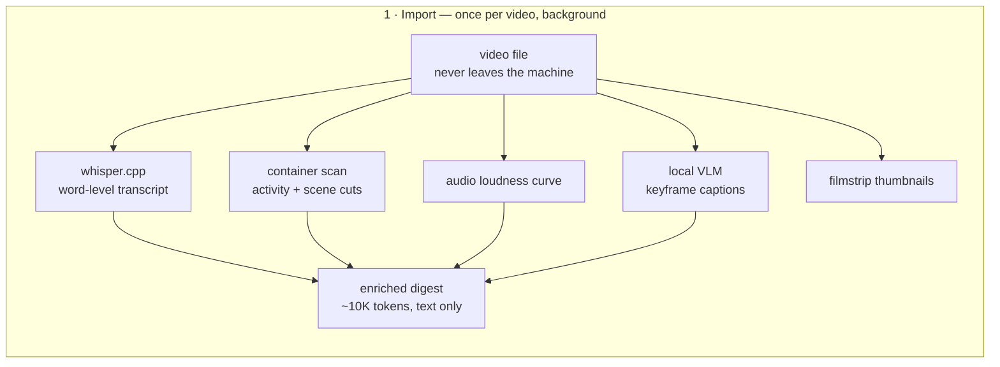
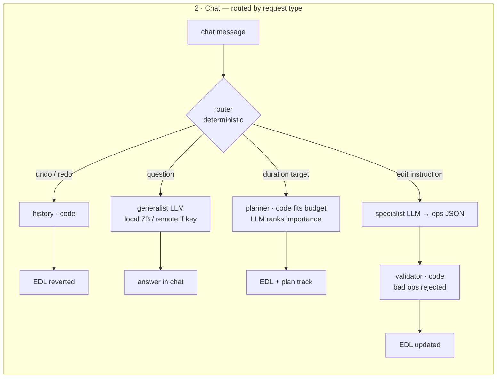
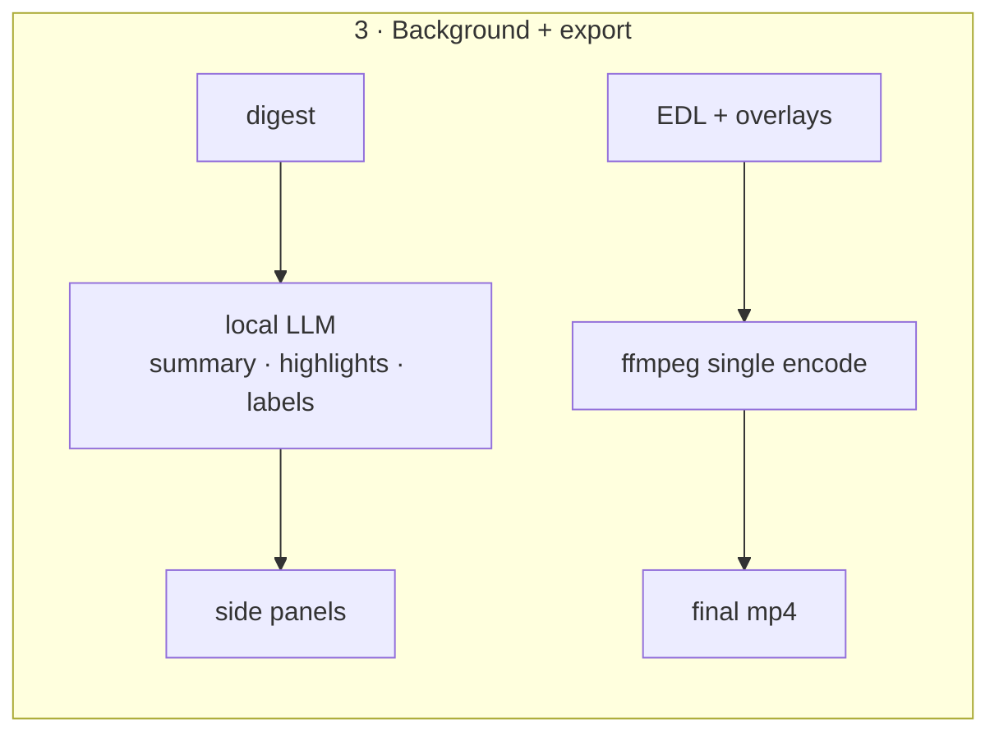

# Prompt Video Editor

**Local-first, prompt-driven video editing. Your footage never leaves your machine.**

Turn a 30-minute raw recording into a labeled, speed-ramped edit by *talking to it*:

> *"identify the key moments, keep them at 1x, speed everything else to 10x so the total is under 5 minutes"*

Everything expensive — transcription, frame analysis, retiming, rendering — runs locally and is free. The only thing that can ever cross the network is a small text digest (never video, frames, audio, or file paths), and only if you opt into a remote model — with the exact outbound payload shown to you first.

## Why this exists

Creators with long raw recordings (build logs, tutorials, interviews, screen sessions) either spend hours in a timeline editor or upload their footage to cloud tools. The pieces for a private alternative all exist — whisper.cpp, ffmpeg, local LLMs and VLMs — but the assembled product didn't. This is that product, and it's open source.

## What it does today

- **Chat with your video** — ask questions ("what is this video about?", "why did you keep that segment?") and give edit instructions in plain language. Conversation memory, action memory, and follow-ups work.
- **Deterministic planning where LLMs fail** — "make it under 5 minutes" routes to a planner: the LLM ranks which segments matter, code does the arithmetic to fit the budget. Infeasible targets get a clarifying question with options instead of a silent wrong edit.
- **Agent plan track** — every automated decision is visible on the timeline: which segments were kept at 1×, which were compressed or cut, and one sentence of *why*, per segment.
- **Vision, not just transcript** — import captions keyframes with a local VLM (moondream), so the digest knows what's *on screen*. "Keep segments where the drone is visible" is an ordinary edit.
- **Ranked key moments** — an LLM picks the 3–8 moments that matter, with reasons, clickable to seek.
- **Multi-track timeline** — filmstrip (real frames, always whole), clips, audio loudness, agent plan, overlays — all aligned under a single playhead, with zoom.
- **Overlays as a real layer** — text/emoji with independent position and timing, draggable in the preview, composited at export via PNG (no ffmpeg freetype dependency).
- **Single-encode export** — the edit is a document (EDL); ffmpeg renders it exactly once, hardware-accelerated, with "match source bitrate" as the default.
- **Pluggable intelligence with smart routing** — local Ollama models by default, Anthropic API optional for faster interactive turns; background jobs (summary, highlights) always stay local. A no-LLM heuristic floor means the app never goes dark.

## Architecture

The core invariant: **the agent edits a document about the video (the EDL) — it never touches pixels.** A bad model response can at worst be rejected by the validator; it cannot corrupt footage or half-apply an edit. Rendering happens once, at export.







Every LLM call reads the digest + conversation memory + last action. In remote mode, the outbound-review pane shows the exact text before anything is sent, with an approval gate.

### The safety contract

- The model returns candidate **IDs, never timestamps**. Unknown ID or malformed op → the whole patch is rejected, with a visible error and **zero change** to the edit.
- No cut may land off an *atom* boundary (silences, sentence ends, scene cuts) — you never cut mid-word.
- Manual edits are **pinned**: later prompts can't touch a hand-adjusted segment unless you name it explicitly.
- One undo stack across prompts and manual edits — every agent action is one Ctrl-Z (or say "undo" in chat).

## Repository layout

```
packages/
  core/      the deterministic engine — no native deps, fully tested
    src/
      types.ts          Analysis → Atoms → Candidates → Digest → EDL → Op DSL
      segment.ts        atoms (legal cut points) → candidates (agent's unit)
      digest.ts         the ONLY artifact permitted to cross the network
      validate.ts       the hard contract: unknown id / bad op → reject
      apply.ts          op application with manual-edit pinning
      session.ts        chat router, duration planner, Q&A, highlights, undo
      render.ts         single-encode ffmpeg plan + overlay compositing
      intelligence/     Backend interface + heuristic / ollama / anthropic / openai-compatible
  import/    the native pass: ffprobe scan, whisper, audio RMS, VLM captions, render exec
  desktop/   Electron app: preview, multi-track timeline, chat, plan track
  cli/       doctor (system check), demo, interactive REPL
```

## Getting started

**Requirements** (checked by a mandatory preflight — the app won't start half-broken):

- Node.js ≥ 20
- ffmpeg + ffprobe (`brew install ffmpeg`)
- whisper.cpp (`brew install whisper-cpp`) + a model:
  ```bash
  mkdir -p models && curl -L -o models/ggml-base.en.bin \
    https://huggingface.co/ggerganov/whisper.cpp/resolve/main/ggml-base.en.bin
  ```
- Optional but strongly recommended — local models via [Ollama](https://ollama.com):
  ```bash
  brew install ollama && brew services start ollama
  ollama pull qwen2.5:7b-instruct   # chat + editing brain
  ollama pull moondream             # frame captions (vision)
  ```

**Run:**

```bash
npm install
npm run doctor                             # verify the system check passes
npm run start --workspace @pve/desktop     # launch the app
```

Or try the engine with zero native deps: `npm run demo` (scripted) / `npm run repl` (interactive, terminal).

**Then:** Open a video → import runs (transcript, scan, captions — all local, cached by content hash so reopening is instant) → chat with it:

- "what are the key highlights?"
- "keep anything discussing the budget at 1x, speed the rest to 8x"
- "make the total under 5 minutes" → planner proposes, plan track shows every decision
- "undo"

Export renders a single mp4, targeting source bitrate.

## Intelligence backends

| Backend | Cost | Egress | Use |
|---|---|---|---|
| Ollama (default when installed) | $0 | none | chat, editing, summaries, vision |
| Anthropic API (BYO key) | ~1¢/edit | digest text only, gated | faster interactive turns |
| OpenAI-compatible endpoint | varies | digest text only, gated | any provider |
| Heuristic (no LLM) | $0 | none | floor — the app never goes dark |

Background jobs (summary, highlights, labels) always run on the best local backend regardless of selection — a remote key is only ever billed for turns you're actively waiting on.

## Roadmap

- Streaming chat responses; cache-ordered prompts (Ollama KV reuse + Anthropic prompt caching)
- Edit-accept logging → teacher-data pipeline → **distilled 1–3B specialist** for ops/ranking (goal: ~2s local turns that beat 7B general models on the hard-instruction eval; open Q&A stays on general models)
- OS-keychain storage for API keys; app packaging/signing
- Retake removal, reorder-by-topic, vertical reframe (P1 ops from the original spec)
- faster-whisper backend; diarization

## Contributing

See [CONTRIBUTING.md](CONTRIBUTING.md). The engine (`@pve/core`) is pure TypeScript with a test suite — most features start there. `npm test` must stay green; the validator contract is non-negotiable.

## License

MIT — see [LICENSE](LICENSE). Note: label overlays composite via PNG so the app works with LGPL ffmpeg builds; if you redistribute ffmpeg binaries, mind their license flags.
